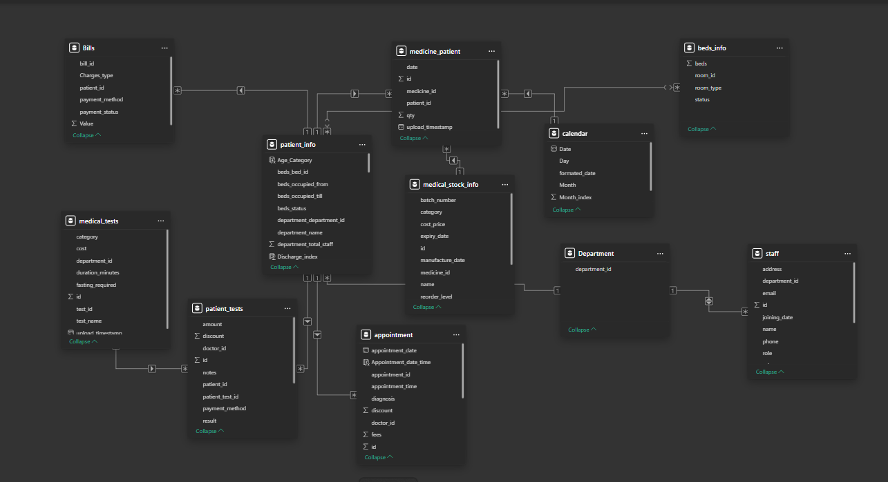

# 🏥 Hospital Data Analysis Dashboard

An interactive **Hospital Management Dashboard** built using **Power BI** and **MySQL**, delivering real-time insights into patients, doctors, appointments, inventory, and hospital finances. Designed to empower data-driven decision-making in healthcare.

---

## 🚀 Project Overview

- 💾 **Backend**: MySQL  
- 📊 **Frontend**: Power BI  
- 🖼️ Patient & doctor images displayed dynamically using **URL fields from the database**

---

## 📌 Key Features

### ✅ KPIs Tracked:
- 🏥 **93% Patient Discharge Rate**
- 💰 **₹713.81K Revenue**
- 💊 **3,928+ Medicine Units Sold**
- 👨‍⚕️ **15 Patients | 15 Doctors | 20 Staff Members**

### ⚙️ MySQL Highlights:
- Views: `patient_info`, `medical_stock_info`, `beds_info`
- Advanced SQL: **CTEs**, **Window Functions**, **Stored Procedures**
- **Image URLs** stored and retrieved to display in Power BI

### 📈 Power BI Highlights:
- 🔗 **Direct MySQL connectivity** for live data
- 📄 **5 interactive pages**: Overview | Patient | Doctor | Hospital | Finance
- 🧠 **Custom DAX Measures** for KPIs
- 🎯 **Drill-through filtering**, **slicers**, and appointment analytics
- 🖼️ **Image rendering via Web URL field formatting** (for doctor & patient photos)

---

## 🧠 Data Model

📌 Below is the **ER Diagram / Data Model** used in this project:

---

## 📄 Power BI Dashboard Report

📥 [Click here to view the full Power BI Dashboard PDF](Hospital_Data_Analysis_Dashboard.pdf)

---

## 🔗 Live Dashboard & Source Code

- 🌐 **Live Demo**: [View Dashboard](https://app.powerbi.com/reportEmbed?reportId=aa10eee8-16ca-49c3-bb67-bb8a78b787ce&autoAuth=true&ctid=c6e549b3-5f45-4032-aae9-d4244dc5b2c4)
- 📁 **GitHub Repository**: [Hospital Data Analysis](https://github.com/Rohitkamble6458/Hospital-data-analysis)

---

## 📞 Contact

💬 For collaboration or questions:  
📧 rohitkamble6458@gmail.com
🔗 [LinkedIn](https://www.linkedin.com/in/rohitkamble6458/)

---

## 🏷️ Tags

`#PowerBI` `#MySQL` `#SQL` `#HospitalAnalytics` `#DAX`  
`#BusinessIntelligence` `#Healthcare` `#DataVisualization` `#CTE` `#ImageURLs`

